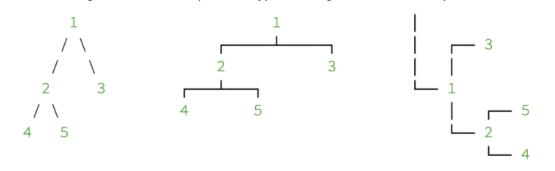
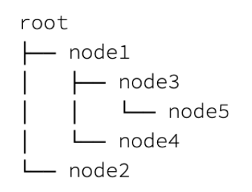
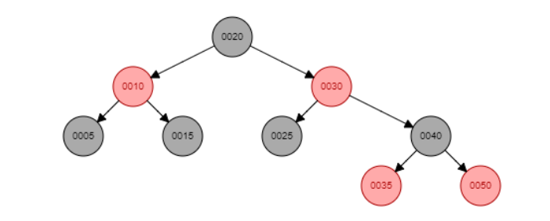

# Red Black Trees

### 1. Implementing the Red-Black Tree Data Structure

Red-black trees are a variant of binary search trees with an additional field for each node to store its colour, which can be either red or black. By colour-coding the nodes according to certain constraints on all paths from the root to the leaves, red-black trees ensure that the length of the longest path is always less than double the length of the shortest path, making the tree approximately balanced. Hence, red-black trees are considered to be a type of self-balancing binary search tree.

For a binary search tree to be a red-black tree, the following properties, known as the "red-black properties," must be satisfied in addition to the properties of a standard binary search tree.

1. Every node must be either red or black.
2. The root must always be coloured black.
3. All leaves must be coloured black.
4. Both children of a red node must be black.
5. For all nodes, all paths from a given node to all its descendant leaves must contain the same number of black nodes.

Implement the Red-Black Tree Data Structure using the properties above. You have to write code for 

- insertion, 
- deletion, and 
- tree query operations; 
  - search, 
  - maximum, and
  - minimum.

The insertion and deletion of nodes may change the whole structure of the tree and may lead to violations of the red-black properties. Therefore, it is essential to check for any such violations at each insertion and deletion. These violations must then be adjusted by using tree rotations and/or recolouring of the nodes after each .

### 2. Printing a Red-Black Tree to the Console

Despite the limitations of drawing with only characters on the console, there are many different diagram shapes to represent tree structures. Choosing one of them mostly depends on the size and balance of the tree.

The following are some of the possible types of diagrams that we can print:



However, the following one is a more practical one that is also easier to implement. We can call it a horizontal tree if we consider the direction in which it grows:



In this representation, three special characters (```│, ├──,``` and ```└──```) along with appropriate number of spaces are used to represent the tree.
An example red-black tree and its representation on a console is shown below.

#### Red-black Tree



#### Console Representation
```
B20
├──R30
│  ├──B40
│  │  ├──R50
│  │  └──R35
│  └──B25
└──R10
   ├──B15
   └──B5
```

Implement a function to print a red-black tree on the console according to the above given format. Use exactly the same characters for the implementation. Follow [this link](https://www.baeldung.com/java-print-binary-tree-diagram) for more information.

### 3. Input and Output

##### Use the following format to insert values into the tree:

**Input**: Space separated values of the node in the order they should be inserted.
**Output**: Print the updated tree to the console using the above format.

An example case is given below.

**Input**: ```5 10 15 20 25 30 35 40 50```

**Output**:
```
B20
├──R30
│  ├──B40
│  │  ├──R50
│  │  └──R35
│  └──B25
└──R10
   ├──B15
   └──B5
```

##### Use the following format for deleting a value from the tree:

**Input**: ```Delete 35```

**Output**: Print the updated tree to the console using the above format.

##### Use the following format to find the maximum value from the tree:

**Input** : ```Search 40```

**Output**: Print ‘True’ or ‘False’ to the console

##### Use the following format to find the maximum value from the tree:

**Input**: ```Max```

**Output**: Print the max value to the console

##### Use the following format to find the minimum value from the tree:

**Input**: ```Min```

**Output**: Print the min value to the console

##### Use the following format to apply multiple operations on the tree:

**Input**: 	
```
5 10 15 20 25 30 35 40 45 50
1
Delete 35
```
  
**Output**: 
```
B20
├──R30
│  ├──B40
│  │  ├──R50
│  │  └──R35
│  └──B25
└──R10
   ├──B15
   └──B5
				← <one newline character>
B20
├──R30
│  ├──B40
│  │  └──R50
│  └──B25
└──R10
   ├──B15
   └──B5
```

In the above example, updated tree should be printed two times; after completing all insertions and after deleting 35


### 4. Example

#### Sample Input
```
5 10 15 20 25 30 35 40 50
4
Delete 35
Min
Max
Search 40
```
The first line indicates the ordered number sequence. Second line denotes the number of operations, which is 4, that should be execute on the created red-black tree. Follwing 4 lines indicates what operations that need to execute.

#### Sample Output
```
B20
├──R30
│  ├──B40
│  │  ├──R50
│  │  └──R35
│  └──B25
└──R10
   ├──B15
   └──B5
   
B20
├──R30
│  ├──B40
│  │  └──R50
│  └──B25
└──R10
   ├──B15
   └──B5
   
5

50

True

```
Every output should be seperated by a newline character. The first tree indicates red-black tree created from the initial ordered number sequence. Next tree denotes the red-black tree after removal of 35. 3rd and 4th outputs are minimum and maximum values of the sequence. Last output is set to True because, 40 is availble in the tree.

You can develop your program using Python or C++. Use the given files for each language to write intended program.

#### Testing
The program can be tested with available tests for each push from the local repository. Otherwise, you can rerun a test through **grading workflow** in the  **action** tab.

### 5. Submission Guidelines

Clone the repository to your local computer, modify the code, and push it back to the Git repository.

Deadline: **2400 hrs** on **25th October 2022**. Marks will be deducted from the late submissions.

#### Note

Don't change the filenames of the repository.

Add the packages that should install, to requirements.txt file for python.

Example: Add numpy package to requiremnts.txt
```
numpy
```

Follow the [link](https://pip.pypa.io/en/stable/reference/requirements-file-format/) for editing requirements.txt file

